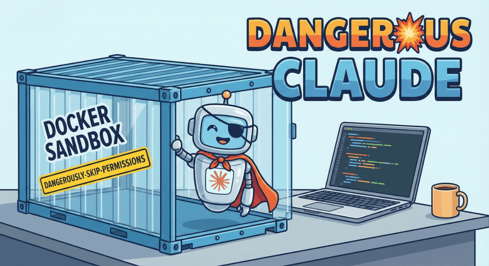

# dangerous-claude



Run [Claude Code](https://docs.anthropic.com/en/docs/claude-code) in a sandboxed Docker container with `--dangerously-skip-permissions`.

## Why?

Claude Code's `--dangerously-skip-permissions` flag lets Claude execute commands without confirmation, making it much more autonomous. But running it on your host machine means Claude has access to everything you do.

**dangerous-claude** solves this by running Claude in a Docker container where it can only access the directories you explicitly mount.

## Features

- **Sandboxed execution**: Claude can only access mounted directories
- **Protected host directories**: `~/.claude`, `~/.gradle`, and `~/.m2` use overlay filesystems - Claude can write to them but cannot delete your host files
- **Shared config**: Uses your host's `~/.claude` directory, so plugins and MCP servers work seamlessly
- **Auto-updates**: Claude Code updates to the latest version on each container start
- **Multiple repos**: Mount as many source directories as needed
- **Conversation persistence**: Continue or resume previous conversations
- **Customizable tools**: Choose which languages and tools to install (Java, Python, Ruby, Rust, etc.)

## Installation

### Prerequisites

- [Docker](https://docs.docker.com/get-docker/) installed and running
- A Claude account (either [Claude Max](https://claude.ai) subscription or [Anthropic API](https://console.anthropic.com/) key)
- **macOS only**: [jq](https://jqlang.github.io/jq/) for Keychain credential sync (`brew install jq`)

### Quick Install

```bash
curl -fsSL https://raw.githubusercontent.com/MattFlower/dangerous-claude/main/install.sh | bash
```

### Manual Install

```bash
git clone https://github.com/MattFlower/dangerous-claude.git ~/.dangerous-claude
echo 'export PATH="$PATH:$HOME/.dangerous-claude"' >> ~/.zshrc  # or ~/.bashrc
source ~/.zshrc
dangerous-claude --build
```

## Usage

### Basic Usage

```bash
# Run claude dangerously, allowing it access to repo1, repo2, and repo3
dangerous-claude ./repo1 ./repo2 ./repo3

# Run claude dangerously, allowing it access to the current directory
dangerous-claude

# Continue the most recent conversation
dangerous-claude --continue ./repo

# Resume a specific conversation by ID
dangerous-claude --resume abc123 ./repo
```

### Other Commands

```bash
dangerous-claude --build       # Force rebuild the Docker image locally
dangerous-claude --init        # Pull image (or build if customized)
dangerous-claude --upgrade     # Update to the latest version
dangerous-claude --shell       # Start a bash shell (for debugging)
dangerous-claude --no-overlay  # Disable overlay protection (writes persist to host)
dangerous-claude --version     # Show version
dangerous-claude --help        # Show help
dangerous-claude --help        # Show help
```

## dangerous-claude isn't perfect -- know what it doesn't protect

While this sandbox isolates Claude from most of your system:

- **Mounted project directories** are fully accessible (read/write). Claude could potentially delete any or all of these directories, potentially causing the loss of any local branches. If you wanted to be extra safe, clone a separate copy of any repository you are feeding to dangerous-claude!
- **Network access** is available (for npm, API calls, etc.) If you provide environment variables that allow dangerous-claude to modify remote resources, it definitely could!
- **Docker access** (with `--docker` flag) gives Claude control over your host's Docker daemon. Claude could delete containers, images, or volumes. It could also start new containers with arbitrary configurations—potentially mounting sensitive host directories or running malicious code. Only use `--docker` when you actually need Docker functionality.

**What IS protected** (unless you use `--no-overlay`):

- **`~/.claude`, `~/.gradle`, `~/.m2`** use overlay filesystems. Claude can read existing files and write new ones, but deletions only affect an ephemeral layer - your host directories remain intact. On container restart, any "deleted" files reappear.

Use `--no-overlay` if you want changes to these directories (like downloaded Maven dependencies) to persist to your host. This trades protection for convenience.

For maximum security, only mount the specific directories you need.
## Git worktrees

I like and use git worktrees pretty liberally as I'm working on projects at work.  Committing, pulling, pushing, or using logs requires access to the "main" directory that has the repository.  Things like committing requires that directory to be read-write.

Consequently, if you are going to use git worktrees with Claude, you have to mount your main directory too!  This can be dangerous if you have multiple active branches.  Consequently, by default dangerous-claude will warn you if you try to do it.

An alternate workflow would be to do your commits outside of dangerous-claude.  This is acceptable for small changes (and I use it).  If you are going to make larger changes, I recommend creating a separate copy of your repo -- it greatly reduces the chance that Claude will erase anything.

## Updating

```bash
dangerous-claude --upgrade
```

This pulls the latest code and rebuilds the Docker image if needed.

Alternatively, you can re-run the installer:

```bash
curl -fsSL https://raw.githubusercontent.com/MattFlower/dangerous-claude/main/install.sh | bash
```

## How It Works

1. **Volume Mounts**: Each directory you specify is mounted at `/workspace/<dirname>`
2. **Overlay Protection**: `~/.claude`, `~/.gradle`, and `~/.m2` are mounted read-only, with an overlay filesystem providing a writable layer. This protects your host files from deletion while allowing Claude to use these directories normally.
3. **Shared Config**: Uses your `~/.claude` directory so authentication, plugins, and MCP servers work
4. **Git Integration**: Mounts `~/.gitconfig` (read-only) so commits appear as you
5. **Auto-Update**: Runs `npm update` on each start to keep Claude Code current

## Configuration

### Environment Variables

`ANTHROPIC_API_KEY` is always passed if set (for API authentication).

Additional environment variables can be passed by listing them in `env.txt` (one variable name per line). Only variables that are set in your shell will be passed. For example:

```bash
# ~/.dangerous-claude/env.txt
GITHUB_TOKEN
NPM_TOKEN
AWS_ACCESS_KEY_ID
AWS_SECRET_ACCESS_KEY
```

### Installed Tools

**Always installed** (required for core functionality):

- Node.js 20.x, git, curl, wget, ripgrep, fd, jq

**Default extras** (from example configs):

- Java 21 (Azul Zulu), Gradle, Maven
- vim, nano, python3, build-essential

### Customizing Installed Packages

The Docker image is customizable via config files:

| File | Purpose | Example | Rebuild required? |
|------|---------|---------|-------------------|
| `packages.apt` | apt packages | vim, python3, ruby | Yes |
| `sdkman.txt` | SDKMAN tools | java:21.0.9-zulu, kotlin, scala | Yes |
| `env.txt` | Environment variables to pass | GITHUB_TOKEN, NPM_TOKEN | No |

On first run, these are created from `.example` files. To customize:

```bash
# Edit the config files
nano ~/.dangerous-claude/packages.apt
nano ~/.dangerous-claude/sdkman.txt
nano ~/.dangerous-claude/env.txt

# Rebuild with your changes (only needed for packages.apt and sdkman.txt)
dangerous-claude --build
```

**For a minimal image** (no Java/Python/etc):

```bash
# Create empty config files
echo "" > ~/.dangerous-claude/packages.apt
echo "" > ~/.dangerous-claude/sdkman.txt
dangerous-claude --build
```

Your customizations are gitignored, so `git pull` won't overwrite them.

## Troubleshooting

### "Permission denied" errors

The container runs as a non-root user. Ensure your mounted directories are readable.

### Container won't start

Try rebuilding: `dangerous-claude --build`

### Authentication issues

If you're logged in on your host but the container asks for auth, make sure `~/.claude.json` exists and contains `hasCompletedOnboarding: true`.

### macOS Keychain sync not working

On macOS, credentials are stored in the system Keychain. If you see "Warning: jq is not installed", run:

```bash
brew install jq
```

If your OAuth token is expired, run:

```bash
dangerous-claude --login
```

## Contributing

Contributions are welcome! If you have ideas for improvements or find bugs, please open an issue or submit a pull request on [GitHub](https://github.com/MattFlower/dangerous-claude).

Some areas where help would be appreciated:

- Support for additional development tools and languages
- Improved documentation
- Bug fixes and edge case handling

## License

MIT License - see [LICENSE](LICENSE) for details.
